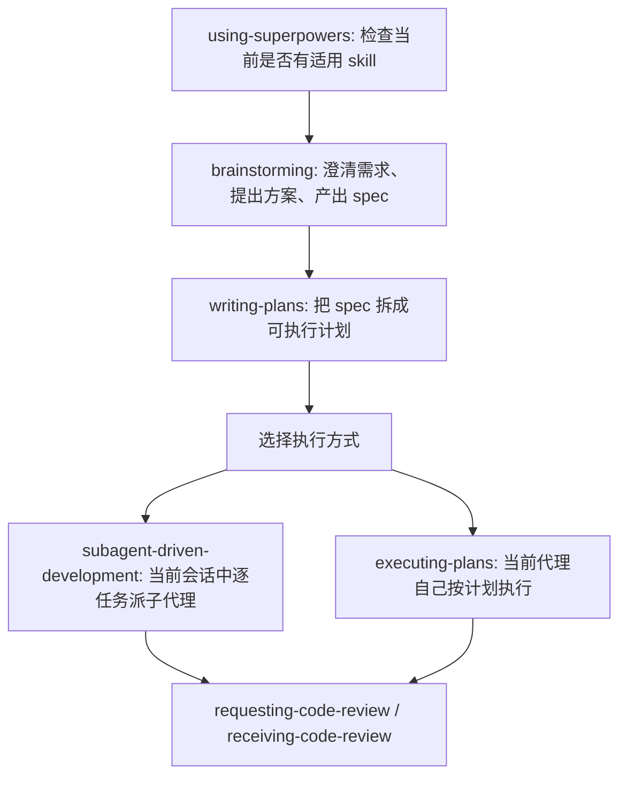
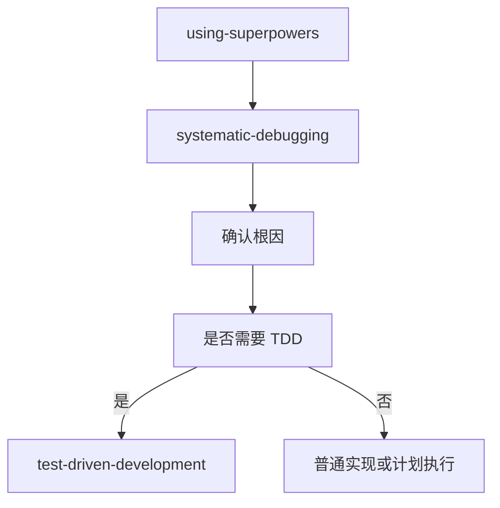

# Superpowers 中文说明

[English README](README.md)

> 当前仓库是 [obra/superpowers](https://github.com/obra/superpowers) 的 fork。
>
> 这个 fork 的目标不是完全改写原项目，而是在保留核心工程流程的前提下，把工作流调得更轻：
> - 只保留 git 分发，不维护 marketplace 分发
> - 不再强制 `worktree`、分支收尾流程、固定 git 仪式
> - TDD 改为按需启用，不再默认强制
> - brainstorming 默认在终端完成，只有用户明确要求时才启用可视化辅助

## 这是什么

Superpowers 不是一个传统意义上的代码库 API，而是一组给编码代理使用的“技能文档”。

每个 skill 都是一个带 YAML frontmatter 的 `SKILL.md` 文件，通常包含两层信息：

1. **触发条件**
   由 `description` 字段描述，告诉代理“什么时候该用这个 skill”。
2. **执行规则**
   由文档正文定义，告诉代理“用这个 skill 时必须怎么做”。

代理不是直接“自由发挥”地完成任务，而是先判断当前请求该走哪个 skill，再按 skill 规定的流程推进。

## 当前保留的 Skills

当前分支保留了这些 skill：

- [`using-superpowers`](skills/using-superpowers/SKILL.md)
- [`brainstorming`](skills/brainstorming/SKILL.md)
- [`writing-plans`](skills/writing-plans/SKILL.md)
- [`subagent-driven-development`](skills/subagent-driven-development/SKILL.md)
- [`executing-plans`](skills/executing-plans/SKILL.md)
- [`requesting-code-review`](skills/requesting-code-review/SKILL.md)
- [`receiving-code-review`](skills/receiving-code-review/SKILL.md)
- [`systematic-debugging`](skills/systematic-debugging/SKILL.md)
- [`test-driven-development`](skills/test-driven-development/SKILL.md)
- [`dispatching-parallel-agents`](skills/dispatching-parallel-agents/SKILL.md)
- [`writing-skills`](skills/writing-skills/SKILL.md)

已经移除的旧 skill：

- `using-git-worktrees`
- `finishing-a-development-branch`
- `verification-before-completion`

这意味着当前 fork 的规则重点是“先设计、再计划、再执行、再 review”，而不是“围绕 git worktree 和固定提交流程组织一切”。

## 整体工作机制

### 1. 会话入口：先检查 skill，再响应

系统的总入口是 [`using-superpowers`](skills/using-superpowers/SKILL.md)。

它定义了一个非常强的规则：

> 只要有 1% 的可能某个 skill 适用，就必须先调用 skill，再响应用户。

它的作用不是提供业务能力，而是防止代理跳过流程、直接开始写代码、直接开始猜。

### 2. 指令优先级

系统遵循这条优先级链：

1. **用户显式指令最高**
2. **skill 规则次之**
3. **默认系统行为最低**

比如：

- 如果某个 skill 说“TDD 永远必须使用”，但用户明确说“这次不要写测试”，以用户要求为准。
- 如果用户没有特别说明，那么代理必须遵守 skill 里的流程要求。

### 3. skill 类型

当前 fork 在 [`using-superpowers`](skills/using-superpowers/SKILL.md) 里把 skill 分成三类：

- **Rigid**
  例如 debugging。必须严格执行，不允许随意弱化。
- **Flexible**
  例如设计和实现模式。核心原则必须保留，但可以按上下文调整表达。
- **Optional**
  当前主要是 TDD。只有用户明确要求测试 / test-first / 强覆盖时才启用。

### 4. 典型执行路径

对于“做功能、改行为、补文档结构”这类请求，当前主链一般是：

对于“修 bug、查异常、分析失败测试”这类请求，通常会先走：

## 核心规则详解

### using-superpowers

路径：[`skills/using-superpowers/SKILL.md`](skills/using-superpowers/SKILL.md)

这是总控 skill，核心规则包括：

- 在任何响应、澄清、探索、编码之前，先判断 skill 是否适用
- 不能靠“这次很简单”作为跳过 skill 的理由
- 问题、修复、调研、改文档，都算任务
- 多个 skill 同时可能适用时，先用流程 skill，再用实现 skill

它的本质是一个“反即兴发挥”的入口约束器。

### brainstorming

路径：[`skills/brainstorming/SKILL.md`](skills/brainstorming/SKILL.md)

它是“所有创作类工作”的前置流程。只要是：

- 创建功能
- 修改行为
- 设计组件
- 做较大的结构性文档改动

都应该先走 brainstorming。

当前 fork 里的 `brainstorming` 机制是：

1. 先查看当前项目上下文
2. 一次只问一个澄清问题
3. 提出 2 到 3 个方案并说明取舍
4. 把设计按小节展示给用户确认
5. 产出 spec 文档
6. 自己做一次 spec 自检
7. 让用户审阅 spec
8. 通过后再进入 `writing-plans`

它有一个强硬门槛：

> 在设计未被用户确认之前，不允许开始实现。

#### 当前 fork 的可视化规则

这个 fork 改掉了原先更激进的 visual companion 引导。现在规则是：

- 默认只在终端完成 brainstorming
- 不主动推荐浏览器可视化
- 只有用户明确要求 mockup / diagram / side-by-side 可视化时，才使用 visual companion

### writing-plans

路径：[`skills/writing-plans/SKILL.md`](skills/writing-plans/SKILL.md)

`writing-plans` 负责把 spec 变成“别人真的可以照着做”的执行计划。

当前 fork 里，它的几个关键原则是：

- 每个任务必须列出明确文件
- 每一步必须足够小，通常是 2 到 5 分钟粒度
- 不能写占位话术
- 如果某步需要改代码，最好直接给代码示例
- 如果任务确实需要测试，才写 TDD 式步骤
- 如果测试不是重点，可以写普通“实现 + 验证”步骤

它明确禁止这类计划内容：

- `TODO`
- `TBD`
- “补充必要错误处理”
- “自行处理边界情况”
- “类似任务 3”

也就是：计划必须能直接执行，不能靠执行者自己脑补。

#### 计划完成后的执行分流

计划写完后，当前 fork 支持两种执行方式：

1. **Subagent-Driven**
   用 [`subagent-driven-development`](skills/subagent-driven-development/SKILL.md) 在当前会话里逐任务派子代理。
2. **Inline Execution**
   用 [`executing-plans`](skills/executing-plans/SKILL.md) 由当前代理自己逐步执行。

### subagent-driven-development

路径：[`skills/subagent-driven-development/SKILL.md`](skills/subagent-driven-development/SKILL.md)

这是当前系统最重要的执行 skill。

它的核心思想不是“让子代理去做”，而是：

> 一个任务一个 implementer，并且每个任务都要经过两段式 review。

具体机制如下：

1. 主控代理先完整读取一次 plan
2. 抽取全部任务文本和上下文
3. 建立 Todo 跟踪
4. 对每个任务派一个 implementer 子代理
5. implementer 完成后，先走 **spec reviewer**
6. spec reviewer 通过后，再走 **code quality reviewer**
7. 任一 reviewer 提出问题，都要回到 implementer 修复并重新 review
8. 全部任务完成后，再做一次整体 code review

#### 为什么 review 顺序不能反

这里的顺序被写死了：

1. **先检查有没有按 spec 实现**
2. **再检查代码质量好不好**

原因很简单：

- 如果功能本身就做偏了，先讨论代码优雅度没有意义
- spec reviewer 负责防止“多做 / 少做 / 做错”
- code quality reviewer 负责防止“虽然做对了，但实现很烂”

#### implementer 的 4 种状态

子代理不是只会返回“完成 / 未完成”，它有四种状态：

- `DONE`
- `DONE_WITH_CONCERNS`
- `NEEDS_CONTEXT`
- `BLOCKED`

这使得主控代理可以根据状态决定：

- 直接进入 review
- 先补上下文
- 先升级模型
- 先拆小任务
- 或者向人类升级

#### 当前 fork 中的变化

相对原版，这个 fork 把 `subagent-driven-development` 调整得更轻：

- 不再要求先 `using-git-worktrees`
- 不再要求最后走 `finishing-a-development-branch`
- 不再强制每个任务都 commit
- TDD 改成“需要时才启用”

### executing-plans

路径：[`skills/executing-plans/SKILL.md`](skills/executing-plans/SKILL.md)

这是不使用子代理时的执行路径。

它的逻辑很直接：

1. 读计划
2. 对计划做批判性审查
3. 如果有歧义或风险，先停下来问
4. 如果没有问题，就逐任务执行
5. 每一步都按计划里的验证命令检查
6. 最后总结变更、验证结果和剩余风险

当前 fork 里的 `executing-plans` 已经去掉了这些依赖：

- `using-git-worktrees`
- `finishing-a-development-branch`
- “必须得到 main/master 明确许可才能开始”

换句话说，它现在只关心“计划有没有问题、执行有没有验证”，不再强绑定某种 git 仪式。

### requesting-code-review

路径：[`skills/requesting-code-review/SKILL.md`](skills/requesting-code-review/SKILL.md)

这个 skill 负责“怎么发起 review”。

它当前的关键机制是：

- review 需要给 reviewer 明确上下文
- reviewer 拿到的是工作产物，不是主控代理的全部历史
- 如果已经 commit，可以用两个 SHA 做比较
- 如果还没 commit，也可以用当前 diff 或临时 checkpoint 做 review
- commit 对 review 有帮助，但不是强制要求

这里的 fork 改动也很明确：

- review 仍然重要
- 但不再把“每任务必须 commit”当成硬前提

### receiving-code-review

路径：[`skills/receiving-code-review/SKILL.md`](skills/receiving-code-review/SKILL.md)

这个 skill 解决的不是“怎么修代码”，而是“收到 review 后怎么处理”。

它反对两种常见错误：

1. **表演式同意**
   比如“你说得太对了”“谢谢提醒”
2. **不验证就照做**
   reviewer 说什么就改什么

它要求的处理顺序是：

1. 先完整读反馈
2. 先理解，再复述
3. 验证反馈是否适用于当前代码库
4. 技术上评估是否正确
5. 再决定接受、澄清或反驳
6. 最后逐项实现并验证

这个 skill 的底层态度是：

> review 是技术判断，不是情绪表演。

### systematic-debugging

路径：[`skills/systematic-debugging/SKILL.md`](skills/systematic-debugging/SKILL.md)

这是 bug / 异常 / 测试失败时的前置 skill。

它的铁律是：

> 没有做根因调查，就不能开始修复。

它把 debugging 划成四阶段：

1. **Root Cause Investigation**
   读错误、稳定复现、看最近改动、采证据、追数据流
2. **Pattern Analysis**
   找已有可工作的模式，对比差异
3. **Hypothesis and Testing**
   一次只验证一个假设
4. **Implementation**
   先做失败用例，再做单点修复，再验证

这个 skill 要解决的问题是：代理非常容易在压力下直接拍脑袋改代码。它就是为了强制代理“先懂，再改”。

### test-driven-development

路径：[`skills/test-driven-development/SKILL.md`](skills/test-driven-development/SKILL.md)

这是当前 fork 变化最大的一项。

原本更接近“默认强制 TDD”，现在改成：

- 用户明确要求 TDD
- 用户明确要求 test-first
- 用户明确要求强覆盖
- 风险高，确实应该严测

在这些场景下才启用。

也就是说，这个 fork 不是反对 TDD，而是反对“无差别强制 TDD”。

当前规则变成：

- **需要时严格执行**
- **不需要时不要机械套用**

### dispatching-parallel-agents

路径：[`skills/dispatching-parallel-agents/SKILL.md`](skills/dispatching-parallel-agents/SKILL.md)

这个 skill 用于多个相互独立的问题并发调查或并发修复。

它适用的前提非常严格：

- 问题必须彼此独立
- 不共享状态
- 不会互相覆盖文件
- 不需要按顺序理解

它的核心原则是：

> 一个独立问题域，对应一个独立 agent。

这和 `subagent-driven-development` 不一样：

- `subagent-driven-development` 是按计划逐任务执行的主流水线
- `dispatching-parallel-agents` 更像“并行分叉处理多个互不相关的问题”

### writing-skills

路径：[`skills/writing-skills/SKILL.md`](skills/writing-skills/SKILL.md)

这个 skill 是“给 skill 作者用的 skill”。

它的核心理念是：

> 写 skill 本身，也应该用 TDD 思维。

它要求：

- 先观察没有 skill 时代理如何失败
- 再写 skill 去堵住那些失败路径
- 然后再验证 skill 是否真的让代理按预期行为执行

所以它把 skill 看成一种“过程文档的程序化约束”。

## 这个 fork 的规则取向

如果用一句话总结当前 fork 的规则取向，就是：

> 保留设计、计划、执行、review 这条主工程链；去掉强制 worktree、强制收尾、强制 commit、强制 TDD 这些偏重仪式感的约束。

### 当前明确保留的东西

- 设计前置
- 计划前置
- debugging 必须先查根因
- 执行必须有验证
- review 必须分阶段
- 用户指令高于 skill

### 当前明确放宽的东西

- 不强制 worktree
- 不强制 finishing skill
- 不强制每步 commit
- 不默认强制 TDD
- 不主动推 visual companion

## 推荐的理解方式

如果你第一次接触这套系统，最建议按下面这个顺序理解：

1. 先看 [`using-superpowers`](skills/using-superpowers/SKILL.md)
2. 再看 [`brainstorming`](skills/brainstorming/SKILL.md)
3. 再看 [`writing-plans`](skills/writing-plans/SKILL.md)
4. 然后看 [`subagent-driven-development`](skills/subagent-driven-development/SKILL.md)
5. 如果你更关心直接执行，再看 [`executing-plans`](skills/executing-plans/SKILL.md)
6. 如果你更关心 bug 修复，再看 [`systematic-debugging`](skills/systematic-debugging/SKILL.md)

这几个 skill 组成了当前 fork 最核心的行为模型。

## 安装与入口

当前 fork 只保留 git 分发入口：

- 英文主说明：[`README.md`](README.md)
- Codex 安装：[`docs/README.codex.md`](docs/README.codex.md)
- OpenCode 安装：[`docs/README.opencode.md`](docs/README.opencode.md)

## 一句话总结

当前这套 Superpowers fork 的本质是：

> 用 skill 把代理的行为从“直接写代码”改造成“先选流程，再做设计，再写计划，再执行，再 review”的工程化工作流系统；同时去掉不必要的重型 git 仪式，让它更适合日常、持续、实用地使用。
